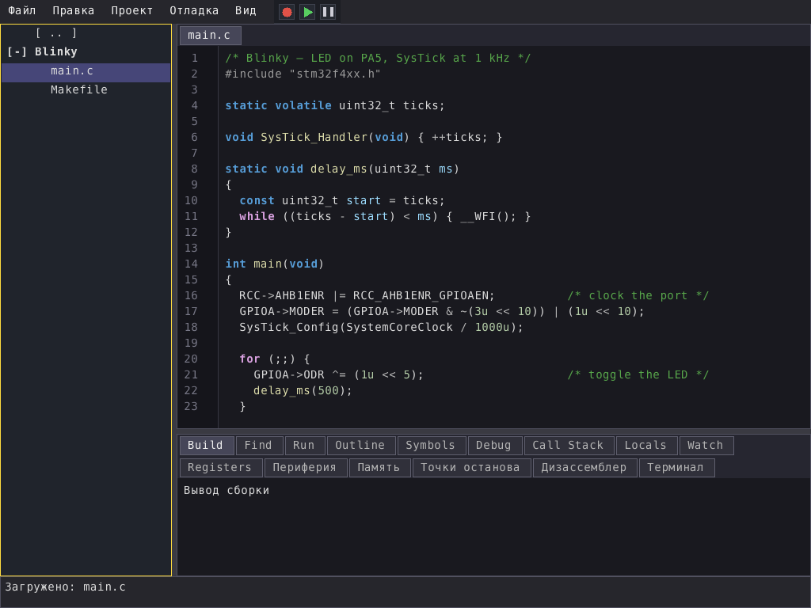
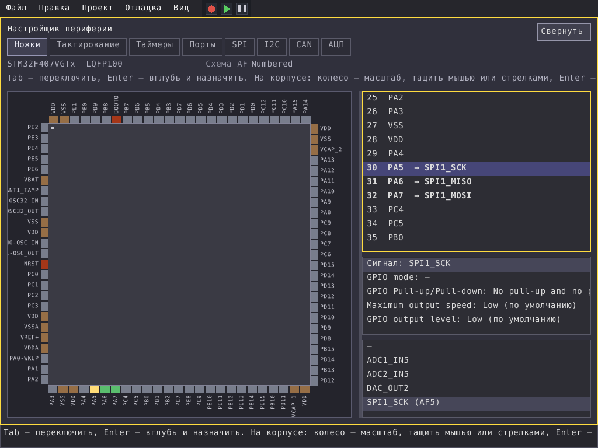

# IntraCore

**A code editor for C/C++ and STM32 firmware.** Projects, syntax highlighting,
C++ analysis with completion, and the embedded side in the same window:
pinout, clock tree and peripheral configurators for STM32, build, flashing and
on-chip debugging.



**Pin configurator** — STM32F407VG in LQFP100, SPI1 routed to PA5/PA6/PA7; the pin data comes from `ARM_Repo/Pinout` shipped here.



## Running it

```sh
./intracore                       the editor
./intracore --project <dir>       open a project directory
```

Linux x86-64 with SDL2 (`sudo apt install libsdl2-2.0-0`). Keep the layout
as it is: `assets/`, `lang-defaults/` and `ARM_Repo/` must sit beside the
binary — fonts, interface languages and MCU data are taken from there. The
editor keeps its own settings in `.intracore-editor/` next to the binary; it
is created on the first start.

## What is in ARM_Repo, and what you add yourself

Shipped here — data extracted from the STM32CubeMX MCU database, which is not
available as plain files anywhere else:

| Directory | Contents |
|---|---|
| `ARM_Repo/Pinout` | pin maps of 2782 parts |
| `ARM_Repo/Clock` | clock trees of 65 lines |
| `ARM_Repo/Hal` | HAL block parameters (1286 files) |

Not shipped — download them from the vendors and put them beside the others:

| Directory | Where from | Needed for |
|---|---|---|
| `ARM_Repo/CMSIS` | ARM CMSIS_5 (`CMSIS/Core`, `CMSIS/Include`) and ST `cmsis_device_<family>` repositories on GitHub (`CMSIS/Device/ST/STM32F4xx/…`) | device headers for new projects |
| `ARM_Repo/SVD` | ST SVD files (STM32CubeIDE or st.com), one directory per family: `SVD/STM32F4/STM32F407.svd` | peripheral registers while debugging |

Building and debugging firmware uses tools from your system:
`arm-none-eabi-gcc`, `make`, `openocd`, `gdb-multiarch`.

## По-русски

**Редактор кода для C/C++ и прошивок STM32.** Проекты, подсветка, разбор C++
с автодополнением, а рядом — встраиваемая часть: настройка выводов, дерева
тактирования и периферии STM32, сборка, прошивка и отладка на кристалле.

Запуск: `./intracore` или `./intracore --project <каталог>`. Нужен Linux
x86-64 и SDL2. Каталоги `assets/`, `lang-defaults/` и `ARM_Repo/` должны
лежать рядом с бинарём: шрифты, языки интерфейса и данные о МК берутся оттуда.

В `ARM_Repo` уже есть то, чего нигде больше не взять, — извлечённое из базы
STM32CubeMX: выводы (2782 деталей), тактирование (65 линеек), параметры HAL.
CMSIS и SVD выкачиваются у ARM и ST (таблица выше) и кладутся в
`ARM_Repo/CMSIS` и `ARM_Repo/SVD`. Для сборки и отладки прошивок нужны
`arm-none-eabi-gcc`, `make`, `openocd`, `gdb-multiarch`.

License: MIT (see LICENSE).
